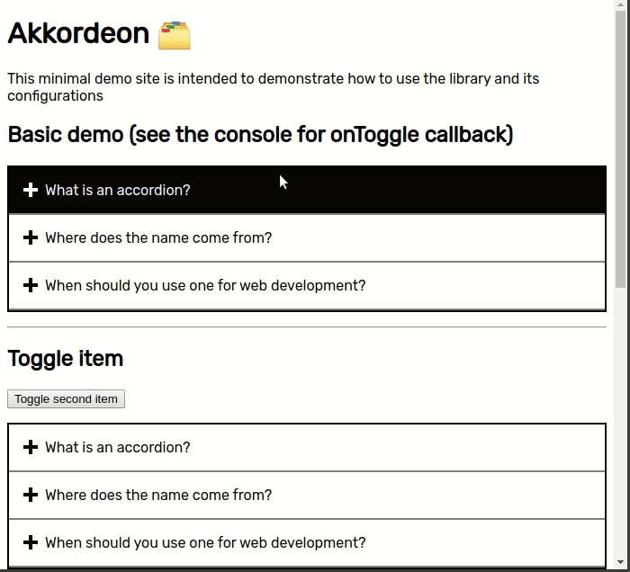

<h1 align="center">
  <br>Akkordeon 🗂️
  <br>
</h1>

<h4 align="center">An easy to hack, accessible, 0 dependency accordion</h4>



# Main features

- Accessible
- No dependencies
- Configurable delay to toggle an element
- Can open multiple panels
- Can open an element by default
- Callback when element is toggled
- Add elements dynamically

## 🚶‍♂️ Getting started

Install with
`npm install akkordeon` or `yarn add akkordeon`

Create your dom with the **mandatory css classes** from the following example and make sure you have an even number of elements, otherwise the library won't work
```html
  <dl id="my-accordion" class="Akkordeon">
    <dt class="Akkordeon-title">Section 1</dt>
    <dd class="Akkordeon-content">
      <p>Section 1 Content...</p>
    </dd>
    <dt class="Akkordeon-title">Section 2</dt>
    <dd class="Akkordeon-content">
      <p>Section 2 Content...</p>
    </dd>
    <dt class="Akkordeon-title">Section 3</dt>
    <dd class="Akkordeon-content">
      <p>Section 3 Content...</p>
    </dd>
  </dl>
```

Include the `Akkordeon` class and import the styles

```javascript
  import { Akkordeon } from 'akkordeon'
  import 'akkordeon/dist/main.css'

  // Example of how to instantiate
  const element = document.getElementById("my-accordion")
  new Akkorden(element)
```

## Why icon on the left? 🤷

There is big debate as to where an accordion icon should be located, based on the research done by [Viger](https://www.viget.com/articles/testing-accordion-menu-designs-iconography/), it's clearer for users to put the icon on the left side with a plus symbol

## Configuration

|Config|Description|Type|Default|
|----|----|----|----|
|`defaultOpenedIndex`|Open an element ad specified index when accordion is loaded|`number`|null|
|`delay`|Time it takes for the animation to toggle an element when clicked|`number`|400|
|`onToggle`|Callback when element is clicked|`(titleElement: Element, contentElement: Element, index: number) => {}`|null|
|`canOpenMultiple`|Enable opening multiple elements|`boolean`|false|

## Public methods

|Method|Description|
|----|----|
|`toggleAtIndex(index: number)`|Toggles element at index|
|`insertNewTitleContentPair(title: string, content: string)`|Adds new element to accordion with respective title and content|

## 👨‍💻 Development

Just run `npm install` and you should be ready to go

## Compatibility

Does not support IE11

## Conventions

Use [SUIT](http://suitcss.github.com) for naming classes
